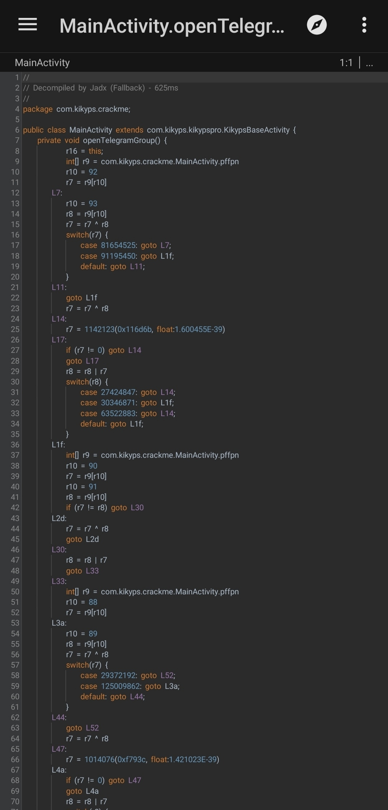
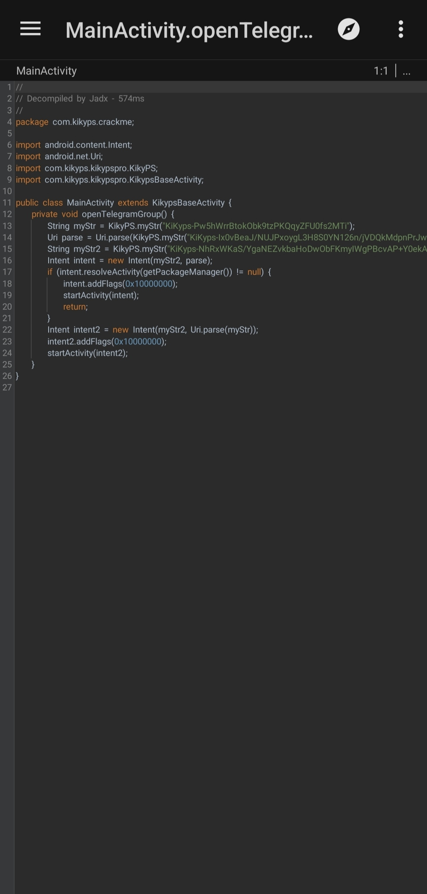

# Garuda Defender

Android RASP project by KiKyps, Protect Mobile App from any vulnerabilities.

# Protection Feature Provided

- Anti Hooking
- Dynamic tamper detection (e.g Code Patching)
- Anti FRIDA
- Anti Memory Dumper
- Anti Debugging (Java & Native)
- HTTP Capture Detection
- String Encryption (Java Layer Protection)
- Control Flow Obfuscation (Java Layer Protection) **[NEW]**
- Root Detection
- Certificate Signature Integrity
- Content Integrity
- And much more.

# Protection Mechanism

- Realtime Protection
- Protection is timeless and strictly protects content 360 degrees
- Using Cryptography
- Obfuscated Methods and Strings
- Works fully offline

### HOT UPDATE 🔥
#### Control Flow Obfuscation (BETA)
Protecting the application's business logic.

    
    

# TODO
- Custom Activity for HTTP capture detection
- Emulator Detection, is it needed?
- Very strong SSL Pinning, "HTTP Capture Detection is enough and this will continue to be developed, but if needed it may be added in the future"

# FAQ

**1. Support Most Android Version**

In theory, it is compatible with Android versions 4.1 to 14. However, it has been tested and performs well on Android 5.0 to 14.

- Support Android 4.1 - 14 (API level 16 - 34).
- Support armeabi-v7a, arm64-v8a, x86 and x86_64.
- Support Android Framework App (Flutter, React Native)

**2. Less RAM Consumption**

Rich in features but still runs efficiently with minimal RAM usage without memory leaks.

https://github.com/kikyps/CrackME/assets/38471660/8aebd3ca-e681-4804-b8c9-6ccb92a801f0

**`Testing carried out in debug mode in theory at release should be lower than the results in the video.`**

**3. Does not affect application performance**

We employ the most effective methods to maintain the performance of the application. This framework ensures that the application remains fast and preserves the speed of app launch.

> We don't use Shell/ClassLoader because we find it less efficient and it slows down the application startup. Decrypting and loading the dex files take up considerable time, which contributes to the delay. Another drawback is that shells can be easily repackaged.

In doing so, we opt for another approach to safeguard your Java source code, protecting it from the exposure of application business logic and the authenticity of its code.

**4. Root User Friendly**

> Sometimes some security framework providers block root users to prevent unwanted things, of course this will have a bad impact on root users who do not have a cyber crime background and have bad intentions for the application user, it is true that detecting root can prevent hackers from moving forward to carry out the action. but not all root users have the same goals and characteristics.

`So with this we really pay attention to security gaps without needing to block access for certain users.
But we still provide the root detection feature as an option and feature support if our clients need it.`\
\
**`So with our project, root users with malicious intent will not be useful even if they have root access`**\
\
**5. Friendly with other applications and piracy tools**

> Sometimes some security framework providers block piracy tools or applications to prevent unwanted things, of course this is not friendly in our opinion.

**`Therefore our goal is that all such tools will be useless for our framework, there is no need to blindly block other applications that are not desired.`**\
\
**6. Custom ROM User Friendly (Unlocked Bootloader)**

> Sometimes some security framework providers detect an unlocked bootloader, to prevent unwanted things, of course this is not friendly for users who like to customize their smartphones.

**`As in the first point, not all users with root or unlocked bootloader have bad intentions.`**

## Future Plan

- Integrating as an Android Studio plugin. (The advantage is being able to use additional features and customize feature requirements directly in the application development).
- The implementation of this framework will be applied across multiple platforms. Protection can be applied through:
    + Integrating as an Android Studio plugin.
    + Android App.
    + Web App.
    + Desktop App.
- In the future, the project will be expanded with the hardening of the iOS application. At the moment, the framework only works for Android applications.

#### To achieve all of that requires extra time, especially since the developer is working alone and there are limitations with iOS devices.

## Lessons

Of course we are aware and care about the security, authenticity, robustness in our systems, so we continue to maintain and research modern vulnerabilities to continue to maintain our security. Carrying out rigorous analysis and testing from various angles to provide the best service for our users.

## 🔗 Links

# Interested?

Contact:\
r383425@proton.me
